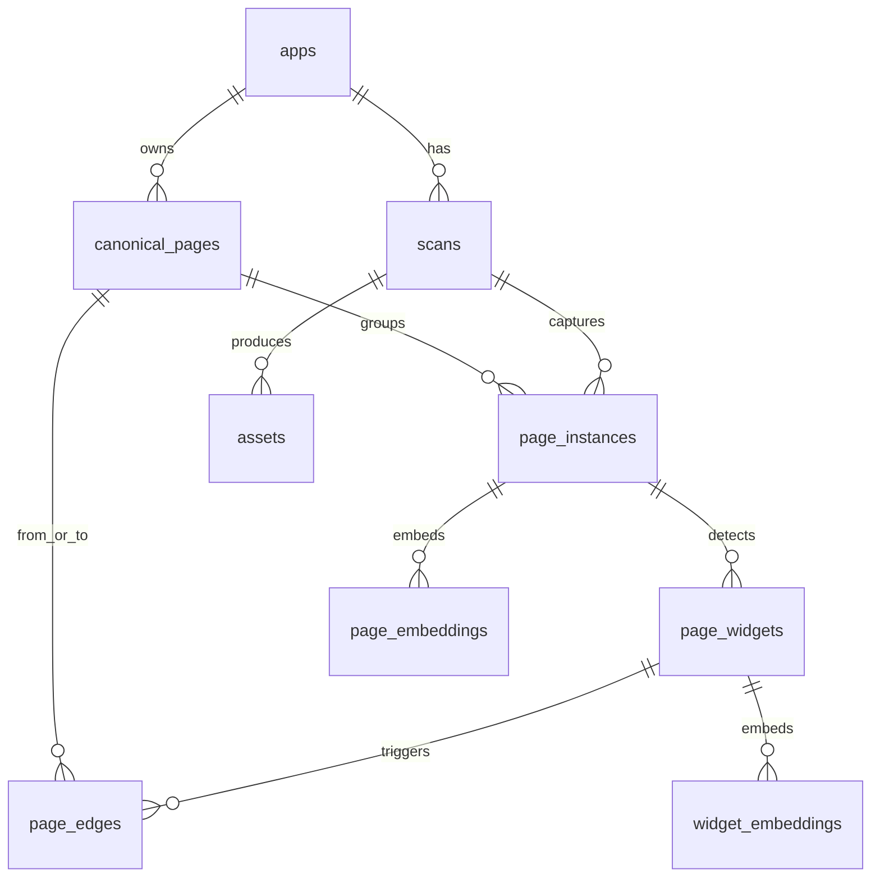

# 后端数据模型与 Page Hash 落地指导

本文档用于指导“第三方应用 APP 图谱层级展示项目”的后端落地。数据来源是手机自动化脚本运行第三方 APP，通过截图、AI 识别、OCR、点击探索生成页面节点、组件和页面跳转关系。项目目标不是单应用，而是覆盖市场 Top225 应用，因此模型必须支持多应用、多扫描、多版本、页面归并、原始证据回溯和向量检索。

## 设计原则

- 不使用页面中文标题作为主键，标题只作为展示字段。
- 区分 `page_instance` 和 `canonical_page`：前者是一次扫描中真实看到的页面，后者是跨扫描归并后的标准页面。
- 完整保留 AI 原始输出，清洗后的结构用于图谱展示和检索。
- Page Hash 不使用单一 hash，而是一组页面指纹：截图、感知视觉、结构、路由。
- 跳转边必须能追溯到触发组件、截图和扫描任务。
- 向量库只存可检索文本和元数据，结构化事实仍以 PostgreSQL 为准。

## 核心实体关系



## PostgreSQL 表设计

### apps

存储 Top225 第三方应用基础信息。

| 字段 | 类型 | 说明 |
|---|---|---|
| app_id | uuid pk | 应用 ID |
| package_name | text unique | Android 包名或 iOS bundle id |
| app_name | text | 应用名称 |
| market_rank | int | 市场排名，例如 Top225 |
| category | text | 应用分类 |
| platform | text | android / ios |
| vendor | text | 开发商 |
| created_at | timestamptz | 创建时间 |
| updated_at | timestamptz | 更新时间 |

建议索引：

```sql
create unique index idx_apps_package on apps(package_name);
create index idx_apps_rank on apps(market_rank);
```

### scans

一次手机自动化探索任务。

| 字段 | 类型 | 说明 |
|---|---|---|
| scan_id | uuid pk | 扫描任务 ID |
| app_id | uuid fk | 所属应用 |
| app_version | text | 被测应用版本 |
| device_id | text | 设备标识 |
| platform | text | android / ios |
| os_version | text | 系统版本 |
| script_version | text | 自动化脚本版本 |
| ai_model | text | AI 识别模型 |
| status | text | running / success / failed / partial |
| started_at | timestamptz | 开始时间 |
| finished_at | timestamptz | 结束时间 |
| error_message | text | 失败原因 |
| scan_config | jsonb | 扫描配置 |

建议索引：

```sql
create index idx_scans_app_time on scans(app_id, started_at desc);
create index idx_scans_status on scans(status);
```

### assets

统一存储页面截图、组件裁剪图、调试图等资源元数据。

| 字段 | 类型 | 说明 |
|---|---|---|
| asset_id | uuid pk | 资源 ID |
| scan_id | uuid fk | 来源扫描 |
| app_id | uuid fk | 所属应用 |
| asset_type | text | page_screenshot / widget_crop / debug |
| storage_url | text | 对象存储地址 |
| local_path | text | 本地路径，可选 |
| sha256 | text | 文件字节 hash |
| width | int | 图片宽 |
| height | int | 图片高 |
| mime_type | text | image/png 等 |
| created_at | timestamptz | 创建时间 |

建议索引：

```sql
create unique index idx_assets_sha on assets(sha256);
create index idx_assets_scan on assets(scan_id, asset_type);
```

### page_instances

一次扫描中真实遇到的页面实例。它是证据层，不直接代表“标准页面”。

| 字段 | 类型 | 说明 |
|---|---|---|
| page_instance_id | uuid pk | 页面实例 ID |
| scan_id | uuid fk | 来源扫描 |
| app_id | uuid fk | 所属应用 |
| canonical_page_id | uuid fk nullable | 归并后的标准页面 |
| page_title | text | AI 推断页面名 |
| page_type | text | home / search / product_detail 等 |
| screenshot_asset_id | uuid fk | 页面截图 |
| screenshot_hash | text | 原始截图 sha256 |
| visual_hash | text | 感知 hash |
| structure_hash | text | 结构 hash |
| route_hash | text nullable | activity / url / route hash |
| ocr_text | text | OCR 文本 |
| ai_summary | text | AI 页面总结 |
| inferred_purpose | text | AI 推断用途 |
| confidence | numeric(4,3) | 页面识别置信度 |
| raw_ai_payload | jsonb | AI 原始输出 |
| normalized_payload | jsonb | 归一化结构 |
| created_at | timestamptz | 创建时间 |

建议索引：

```sql
create index idx_page_instances_scan on page_instances(scan_id);
create index idx_page_instances_app_hash on page_instances(app_id, structure_hash);
create index idx_page_instances_canonical on page_instances(canonical_page_id);
create index idx_page_instances_raw_gin on page_instances using gin(raw_ai_payload);
```

### canonical_pages

跨扫描归并后的标准页面。前端图谱建议优先展示 canonical 页面。

| 字段 | 类型 | 说明 |
|---|---|---|
| canonical_page_id | uuid pk | 标准页面 ID |
| app_id | uuid fk | 所属应用 |
| canonical_page_key | text | 应用内稳定页面 key |
| display_name | text | 展示名 |
| page_type | text | 页面类型 |
| representative_asset_id | uuid fk | 代表截图 |
| primary_structure_hash | text | 主要结构 hash |
| primary_visual_hash | text | 主要视觉 hash |
| primary_route_hash | text nullable | 主要路由 hash |
| first_seen_scan_id | uuid fk | 首次出现扫描 |
| last_seen_scan_id | uuid fk | 最近出现扫描 |
| instance_count | int | 归并实例数 |
| review_status | text | pending / confirmed / rejected |
| created_at | timestamptz | 创建时间 |
| updated_at | timestamptz | 更新时间 |

建议索引：

```sql
create unique index idx_canonical_pages_key on canonical_pages(app_id, canonical_page_key);
create index idx_canonical_pages_type on canonical_pages(app_id, page_type);
create index idx_canonical_pages_hash on canonical_pages(app_id, primary_structure_hash);
```

### page_widgets

AI 在页面中识别出的可点击组件、tab、卡片入口等。

| 字段 | 类型 | 说明 |
|---|---|---|
| widget_id | uuid pk | 组件 ID |
| page_instance_id | uuid fk | 所属页面实例 |
| canonical_page_id | uuid fk nullable | 所属标准页面 |
| widget_type | text | button / tab / card / input |
| text | text | OCR 或 AI 识别文本 |
| semantic_name | text | 语义名称 |
| function_desc | text | 功能描述 |
| relative_position | text | top / middle / bottom |
| bbox_x | int | 组件左上 x |
| bbox_y | int | 组件左上 y |
| bbox_width | int | 组件宽 |
| bbox_height | int | 组件高 |
| clickable | boolean | 是否可点击 |
| expected_result | text | AI 预期点击结果 |
| widget_asset_id | uuid fk nullable | 组件裁剪图 |
| confidence | numeric(4,3) | 识别置信度 |
| raw_ai_payload | jsonb | 原始组件识别结果 |
| created_at | timestamptz | 创建时间 |

建议索引：

```sql
create index idx_widgets_page_instance on page_widgets(page_instance_id);
create index idx_widgets_canonical on page_widgets(canonical_page_id);
create index idx_widgets_clickable on page_widgets(clickable);
```

### page_edges

一次点击探索形成的页面跳转关系。

| 字段 | 类型 | 说明 |
|---|---|---|
| edge_id | uuid pk | 跳转边 ID |
| scan_id | uuid fk | 来源扫描 |
| app_id | uuid fk | 所属应用 |
| from_page_instance_id | uuid fk | 来源页面实例 |
| to_page_instance_id | uuid fk nullable | 目标页面实例 |
| from_canonical_page_id | uuid fk nullable | 来源标准页面 |
| to_canonical_page_id | uuid fk nullable | 目标标准页面 |
| widget_id | uuid fk nullable | 触发组件 |
| action_type | text | tap / swipe / back / input |
| label | text | 边展示名称 |
| confidence | numeric(4,3) | 关系置信度 |
| status | text | discovered / confirmed / failed |
| raw_action_payload | jsonb | 点击前后原始记录 |
| created_at | timestamptz | 创建时间 |

建议索引：

```sql
create index idx_edges_scan on page_edges(scan_id);
create index idx_edges_from_to on page_edges(from_canonical_page_id, to_canonical_page_id);
create index idx_edges_widget on page_edges(widget_id);
```

### page_embeddings / widget_embeddings

如果 PostgreSQL 使用 pgvector，可直接落库；如果使用独立向量库，则 PostgreSQL 中保留向量记录的外部 ID。

| 字段 | 类型 | 说明 |
|---|---|---|
| embedding_id | uuid pk | embedding 记录 ID |
| app_id | uuid fk | 所属应用 |
| owner_type | text | page / widget |
| owner_id | uuid | page_instance_id / canonical_page_id / widget_id |
| vector_store | text | pgvector / milvus / qdrant |
| vector_id | text | 向量库 ID |
| embedding_model | text | embedding 模型 |
| embedding_text | text | 生成向量的文本 |
| metadata | jsonb | 检索元数据 |
| created_at | timestamptz | 创建时间 |

pgvector 示例：

```sql
-- 以 1536 维为例，实际维度按 embedding 模型调整
create extension if not exists vector;

create table page_embeddings (
  embedding_id uuid primary key,
  app_id uuid not null references apps(app_id),
  owner_type text not null,
  owner_id uuid not null,
  embedding_model text not null,
  embedding_text text not null,
  embedding vector(1536),
  metadata jsonb,
  created_at timestamptz not null default now()
);

create index idx_page_embeddings_app on page_embeddings(app_id, owner_type);
create index idx_page_embeddings_vector on page_embeddings using ivfflat (embedding vector_cosine_ops);
```

## Page Hash / 页面指纹设计

### 不建议只做一个 page_hash

单一 hash 无法同时解决“完全一致”“视觉近似”“结构一致”“路由一致”四种问题。Top225 应用规模下，页面会受到广告、时间、推荐内容、登录态、定位城市、AB 实验影响。建议存储以下指纹：

| 指纹 | 生成来源 | 用途 | 稳定性 |
|---|---|---|---|
| screenshot_hash | 原始截图字节 sha256 | 判断截图文件完全一致 | 低 |
| visual_hash | pHash / dHash / aHash | 判断视觉近似 | 中 |
| structure_hash | AI/OCR 归一化结构 | 页面去重主依据 | 高 |
| route_hash | package/activity/url/route | 如果能拿到路由，稳定识别页面 | 高 |

### screenshot_hash

```txt
screenshot_hash = sha256(image_bytes)
```

适合去重完全相同截图，不适合作为页面归并主键。

### visual_hash

建议使用感知 hash：

```txt
visual_hash = phash(normalized_screenshot)
```

归一化建议：

- 裁掉状态栏、导航栏。
- 统一缩放到固定尺寸。
- 可选：对动态广告区域做模糊或遮罩。

比较方式：

```txt
same_visual_page if hamming_distance(visual_hash_a, visual_hash_b) <= threshold
```

阈值需要通过样本调参，初始可用 8-12。

### structure_hash

这是推荐作为页面归并核心的指纹。它来自 AI/OCR 结构化结果，而不是原始截图。

参与字段建议：

```json
{
  "page_type": "product_detail",
  "regions": ["top_bar", "content_area", "bottom_action"],
  "visible_text_intents": ["商品标题", "价格", "评价", "加入购物车"],
  "widgets": [
    {
      "type": "button",
      "semantic_name": "加入购物车",
      "relative_position": "bottom"
    },
    {
      "type": "button",
      "semantic_name": "立即购买",
      "relative_position": "bottom"
    }
  ]
}
```

归一化步骤：

1. 将文本转成简体、去空格、去标点噪声。
2. 删除动态文本：价格、时间、角标数量、用户名、订单号、手机号、城市天气等。
3. 将具体文案映射为语义槽位，例如“¥129.00”归一为 `price`。
4. widgets 按 `relative_position + widget_type + semantic_name` 排序。
5. regions 按页面空间顺序排序。
6. 生成稳定 JSON，字段按 key 排序。
7. 对 JSON 字符串做 sha256。

示例：

```txt
structure_hash = sha256(canonical_json({
  page_type,
  regions,
  visible_text_intents,
  widgets
}))
```

### route_hash

如果自动化脚本能拿到 Activity、WebView URL、deeplink、router name，则应单独生成：

```txt
route_hash = sha256(package_name + activity_name + normalized_url_path + route_name)
```

注意 URL 要移除 query 中的动态参数：

```txt
order_id
user_id
timestamp
token
session
trace_id
```

## Canonical Page 归并策略

推荐不要在入库时强行只靠一个 hash 合并，而是使用评分模型。

### 初始规则

同一个 `app_id` 内，满足任一条件可候选归并：

```txt
route_hash 相同
or structure_hash 相同
or visual_hash 汉明距离 <= 10
or 向量相似度 >= 0.88
```

### 归并评分

建议总分 100：

| 因素 | 分值 |
|---|---:|
| route_hash 相同 | 40 |
| structure_hash 相同 | 35 |
| visual_hash 距离足够近 | 15 |
| page_type 相同 | 5 |
| 关键组件集合相似 | 5 |

建议阈值：

```txt
score >= 70 自动归并
50 <= score < 70 待人工复核
score < 50 新建 canonical_page
```

## 向量库内容设计

### 页面 embedding_text

```txt
应用：{app_name}
页面：{page_title}
页面类型：{page_type}
业务用途：{inferred_purpose}
OCR文本：{ocr_text}
页面区域：{regions}
可点击组件：{widget_semantic_names}
下游页面：{outgoing_page_titles}
```

### 组件 embedding_text

```txt
应用：{app_name}
所在页面：{page_title}
组件类型：{widget_type}
组件文本：{text}
语义名称：{semantic_name}
功能：{function_desc}
点击结果：{expected_result}
```

### 向量库 metadata

```json
{
  "app_id": "...",
  "scan_id": "...",
  "owner_type": "page",
  "owner_id": "...",
  "canonical_page_id": "...",
  "page_type": "product_detail",
  "structure_hash": "...",
  "route_hash": "..."
}
```

## 入库流程建议

1. 手机脚本产生截图、动作日志、设备上下文。
2. 保存原始截图到对象存储，写入 `assets`。
3. AI/OCR 识别页面和组件，完整结果写入 `page_instances.raw_ai_payload`。
4. 对 AI 输出做 normalized 解析，生成 `normalized_payload`。
5. 生成 `screenshot_hash`、`visual_hash`、`structure_hash`、`route_hash`。
6. 查询候选 `canonical_pages`，按归并评分判断是否合并。
7. 写入 `page_widgets`。
8. 点击组件后写入 `page_edges`。
9. 生成页面和组件 embedding_text，写入向量库及 embedding 记录。
10. 前端图谱优先读取 canonical 页面和 canonical 边；调试时可回看 page_instance 和 raw payload。

## 当前前端字段到后端字段映射

| 前端字段 | 后端建议 |
|---|---|
| title | canonical_pages.display_name / page_instances.page_title |
| type | page_type |
| imageIndex | assets.asset_id 或 representative_asset_id |
| purpose | inferred_purpose |
| edge.from | from_canonical_page_id |
| edge.to | to_canonical_page_id |
| edge.label | page_edges.label |
| widget.imageIndex | page_widgets.widget_asset_id |
| widget.confidence | page_widgets.confidence |

## 最小可落地版本

如果第一阶段不想一次做太重，至少落以下表：

- `apps`
- `scans`
- `assets`
- `page_instances`
- `canonical_pages`
- `page_widgets`
- `page_edges`
- `page_embeddings`

至少生成以下页面指纹：

- `screenshot_hash`
- `structure_hash`
- `visual_hash`

`route_hash` 如果脚本暂时拿不到，可以先 nullable，后续增强。
