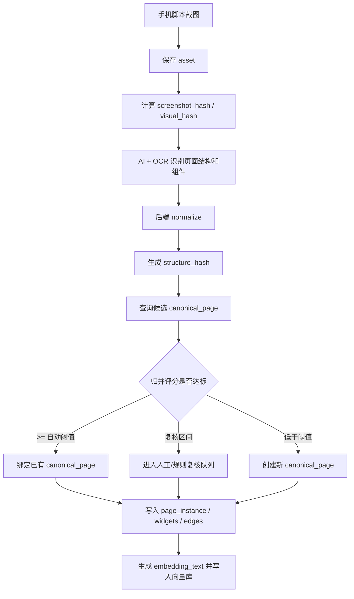

# 截图入库校验与功能页面去重流程

本文档描述手机自动化脚本截图后，后端如何校验、归并和生成 APP 功能页面图谱。核心目标是：动态内容不同但页面结构和功能一致时，只生成一个功能页面。

典型例子：

```txt
抖音刷视频：
  视频 A、视频 B、视频 C 的画面、标题、作者、点赞数都不同
  但它们都是同一个“短视频 Feed 功能页面”
```

因此系统不能用截图文件是否相同来判断是否新页面，而要用页面结构、组件语义和交互模式判断。

## 核心结论

- 截图可以全部保存为证据。
- 是否创建新功能页面，必须由后端校验。
- 前端图谱默认展示 `canonical_page`，不是每一张截图。
- 每次真实看到的页面进入 `page_instance`。
- 多个 `page_instance` 可以归并到同一个 `canonical_page`。

## 分层模型

### asset

保存原始截图和组件裁剪图。

```txt
asset = 证据文件
```

即使后续判断不是新功能页面，截图仍应保存，方便回放、复核、训练和调试。

### page_instance

一次扫描中真实看到的页面。

```txt
page_instance = 某次扫描某一刻看到的具体页面
```

例如抖音连续刷到 3 个视频：

```txt
page_instance_1 = 视频 A 页面截图
page_instance_2 = 视频 B 页面截图
page_instance_3 = 视频 C 页面截图
```

### canonical_page

归并后的标准功能页面。

```txt
canonical_page = 功能页面
```

抖音示例：

```txt
canonical_page = 短视频 Feed 页面
```

三个 page_instance 都归并到这一个 canonical_page。

## 后端入库总流程



## 截图入库校验

后端收到截图后，不应直接创建新页面，而是按以下顺序处理。

### 1. 保存原始截图

写入 `assets`：

```txt
asset_type = page_screenshot
storage_url
sha256
width
height
scan_id
app_id
```

### 2. 计算截图文件 hash

```txt
screenshot_hash = sha256(image_bytes)
```

用途：

- 判断截图文件是否完全重复。
- 避免重复上传相同图片。
- 作为证据文件索引。

限制：

- 不适合判断功能页面是否相同。
- 视频画面、广告、推荐内容变化都会导致 hash 不同。

### 3. 计算感知 hash

```txt
visual_hash = phash(normalized_image)
```

用途：

- 判断视觉是否大体相似。
- 作为候选召回条件之一。

归一化建议：

- 裁掉状态栏和系统导航栏。
- 统一缩放尺寸。
- 可选：对大面积动态媒体区域做模糊或遮罩。

### 4. AI/OCR 结构识别

AI 不只输出页面标题，还要输出：

```txt
page_type
regions
visible_texts
visible_text_intents
widgets
layout_signature
interaction_pattern
dynamic_regions
confidence
```

其中 `dynamic_regions` 非常重要，用来告诉后端哪些区域不应参与页面结构 hash。

## Structure Hash 生成

`structure_hash` 是功能页面去重的核心。

它不描述“内容是什么”，而描述“这个页面是什么功能结构”。

### 应进入 structure_hash 的内容

稳定结构：

```txt
page_type
layout_signature
regions
widget_type
widget_semantic_name
widget_relative_position
interaction_pattern
stable_tab_names
stable_navigation_items
```

稳定交互：

```txt
tap_comment_open_panel
tap_share_open_panel
vertical_swipe_next_content
tap_product_card_open_detail
tap_search_submit
```

稳定布局：

```txt
top_bar
content_feed
right_action_rail
bottom_tab_bar
bottom_action_bar
```

### 不应进入 structure_hash 的内容

动态内容：

```txt
视频画面
商品图片
广告素材
推荐标题
用户昵称
头像
点赞数
评论数
价格
订单号
手机号
时间
定位城市
个性化推荐文案
```

这些字段可以保存在 `raw_ai_payload`、`ocr_text`、`page_instance` 中，但不能影响功能页面归并。

## 抖音视频 Feed 示例

### 原始页面实例 A

```json
{
  "page_title": "推荐视频",
  "visible_texts": ["张三", "今天去海边", "12.3w", "8912"],
  "media_content": "beach_video",
  "widgets": ["头像", "点赞", "评论", "收藏", "分享", "首页", "朋友", "消息", "我"]
}
```

### 原始页面实例 B

```json
{
  "page_title": "推荐视频",
  "visible_texts": ["李四", "猫咪太可爱了", "2.1w", "322"],
  "media_content": "cat_video",
  "widgets": ["头像", "点赞", "评论", "收藏", "分享", "首页", "朋友", "消息", "我"]
}
```

### 归一化结构

两个实例都应 normalize 成同一个结构：

```json
{
  "page_type": "video_feed",
  "layout_signature": [
    "full_screen_media",
    "right_action_rail",
    "bottom_author_caption",
    "bottom_tab_bar"
  ],
  "widgets": [
    { "type": "button", "semantic_name": "作者主页", "position": "right_top" },
    { "type": "button", "semantic_name": "点赞", "position": "right_middle" },
    { "type": "button", "semantic_name": "评论", "position": "right_middle" },
    { "type": "button", "semantic_name": "收藏", "position": "right_middle" },
    { "type": "button", "semantic_name": "分享", "position": "right_middle" },
    { "type": "tab", "semantic_name": "首页", "position": "bottom" },
    { "type": "tab", "semantic_name": "朋友", "position": "bottom" },
    { "type": "tab", "semantic_name": "消息", "position": "bottom" },
    { "type": "tab", "semantic_name": "我的", "position": "bottom" }
  ],
  "interaction_pattern": [
    "vertical_swipe_next_content",
    "tap_author_open_profile",
    "tap_comment_open_panel",
    "tap_share_open_panel"
  ]
}
```

然后生成：

```txt
structure_hash = sha256(canonical_json(normalized_structure))
```

结果：

```txt
视频 A page_instance -> canonical_page: 短视频 Feed 页面
视频 B page_instance -> canonical_page: 短视频 Feed 页面
视频 C page_instance -> canonical_page: 短视频 Feed 页面
```

## Normalize 规则

### 文本归一化

建议处理：

```txt
转简体
小写化英文
去多余空白
去标点噪声
数字归一化
金额归一化
时间归一化
手机号/订单号/ID 归一化
```

示例：

```txt
¥129.00 -> <price>
12.3w -> <count>
2026-07-05 -> <date>
13812345678 -> <phone>
```

### 组件归一化

组件参与 hash 前，只保留稳定字段：

```json
{
  "type": "button",
  "semantic_name": "评论",
  "relative_position": "right_middle"
}
```

不参与 hash 的字段：

```txt
bbox 精确像素
颜色
截图 asset_id
原始 OCR 文本
置信度
动态数字
```

`bbox` 可以用于排序和定位，但不要直接进入 hash。建议先转成相对位置：

```txt
top_left
top_center
top_right
middle_left
middle
middle_right
bottom_left
bottom_center
bottom_right
right_action_rail
bottom_tab_bar
```

### 排序规则

生成 hash 前必须排序，避免 AI 输出数组顺序波动。

建议：

```txt
regions 按页面空间顺序排序
widgets 按 relative_position + type + semantic_name 排序
interaction_pattern 按字典序排序
visible_text_intents 按字典序排序
```

## 候选召回策略

同一个 `app_id` 内，优先查找候选 canonical_page。

候选条件：

```txt
route_hash 相同
or structure_hash 相同
or visual_hash 汉明距离 <= threshold
or page embedding 相似度 >= threshold
or page_type 相同且关键组件集合相似
```

不要跨 app 自动归并。不同 APP 可以有相同功能页面类型，但它们仍是不同应用内的页面。

跨 app 相似度可以用于分析，比如“哪些 APP 有相似功能页面”，但不应用作 canonical_page 主键归并。

## 归并评分

建议用评分而不是单条件硬判。

| 因素 | 分值 |
|---|---:|
| route_hash 相同 | 40 |
| structure_hash 相同 | 35 |
| page_type 相同 | 10 |
| 关键组件集合相似 | 10 |
| visual_hash 距离足够近 | 5 |

建议阈值：

```txt
score >= 75 自动归并
55 <= score < 75 待复核
score < 55 创建新 canonical_page
```

如果 `route_hash` 和 `structure_hash` 同时相同，可以直接自动归并。

## 动态内容页面的特殊处理

以下页面类型应默认开启动态区域过滤：

```txt
video_feed
live_room
news_feed
product_feed
recommend_feed
search_result
comment_panel
message_list
order_list
```

这些页面的内容高度动态，但功能结构稳定。

建议 AI 输出：

```json
{
  "dynamic_regions": [
    {
      "region_name": "media_content",
      "reason": "video frame changes per item",
      "exclude_from_structure_hash": true
    }
  ]
}
```

后端 normalize 时必须尊重该标记。

## 新建 canonical_page 的条件

只有满足以下情况才创建新功能页面：

```txt
没有 route_hash 命中
没有 structure_hash 命中
候选 canonical_page 评分低于阈值
关键组件集合显著不同
interaction_pattern 显著不同
页面类型不同且无法映射为同一功能
```

例如短视频 Feed 页面点击评论后出现评论面板：

```txt
短视频 Feed 页面 != 评论面板
```

因为布局结构、组件集合、交互模式都不同，应创建新的 canonical_page。

## 后端接口建议

### 创建页面实例

```http
POST /api/scans/{scan_id}/page-instances
```

请求核心字段：

```json
{
  "app_id": "uuid",
  "screenshot_asset_id": "uuid",
  "route_context": {
    "package_name": "com.ss.android.ugc.aweme",
    "activity": "MainActivity",
    "url": null
  },
  "ai_payload": {},
  "ocr_text": "..."
}
```

后端返回：

```json
{
  "page_instance_id": "uuid",
  "canonical_page_id": "uuid",
  "dedup_result": "merged",
  "dedup_score": 92,
  "hashes": {
    "screenshot_hash": "...",
    "visual_hash": "...",
    "structure_hash": "...",
    "route_hash": "..."
  }
}
```

### 创建跳转边

```http
POST /api/scans/{scan_id}/edges
```

请求核心字段：

```json
{
  "from_page_instance_id": "uuid",
  "to_page_instance_id": "uuid",
  "widget_id": "uuid",
  "action_type": "tap",
  "raw_action_payload": {}
}
```

后端应自动补充：

```txt
from_canonical_page_id
to_canonical_page_id
```

## 前端图谱展示规则

默认展示：

```txt
canonical_pages + canonical_edges
```

调试模式展示：

```txt
page_instances + raw edges
```

建议图谱节点支持切换：

```txt
功能页面视图
扫描实例视图
```

功能页面视图适合汇报和分析；扫描实例视图适合排查 AI 识别和脚本行为。

## 推荐落地顺序

第一阶段：

```txt
assets
page_instances
canonical_pages
page_widgets
page_edges
structure_hash
screenshot_hash
```

第二阶段：

```txt
visual_hash
embedding
归并评分
复核队列
```

第三阶段：

```txt
动态区域识别
跨版本页面演进
跨 APP 功能相似分析
```

## 质量检查项

每次入库后建议记录：

```txt
是否生成 structure_hash
是否命中 canonical_page
归并评分
候选 canonical_page 数量
是否进入复核队列
AI 识别置信度
组件数量
可点击组件数量
```

这些指标可以帮助你判断 Top225 应用的大规模扫描质量。
